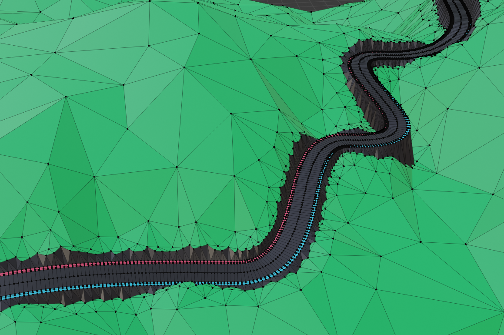
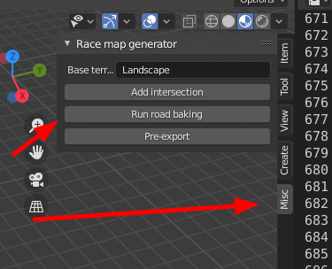

# Blender racemap generator addon
**WARNING: hardcore work-in-progress software ahead**

A Blender addon that takes in a landscape mesh, curves for roads and spheres for intersections, from which creates a single mesh of terrain with multiple materials.

Right now it's insanely finicky to use, and I'm sorry about that, I'm planning on upgrading the thing in the near future. If you can help with Blender UI and addon creation, please do contact me if you're up for some coding, it would be a great help.

Also, contact me if you need help setting up, happy to help, I don't expect to get 30 requests a day anyways.
My email is public on my profile. If you can't see/find it, create an issue.

# How it works
By and large, the steps in the script are the following:
1. Generates meshes from the curves, these will be roads
2. Connects the edges of road meshes that are connected by intersections
3. Fills out these intersections
4. Merges intersection meshes and road meshes into one
5. Fills patches of land inside and outside of road loops with triangles
6. Connects land and road meshes

For filling parts with triangles, it uses the Python wrapper (found here: https://rufat.be/triangle/)
of Jonathan Richard Shewchuk's triangulator library (found here: https://www.cs.cmu.edu/~quake/triangle.html)

# Usage

### 1. Create temporary collections ###
Create collections called "TMP" and "Roads".

### 2. Create basic landscape ###
You need to place a basic landscape created. It can be any flat mesh, I recommend you use the A.N.T. Landscape addon that comes with Blender.
Create a "Terrain" collection and move it in there.

### 3. Create curves ###
The road meshes will be generated from curves and road "segments", both of which need to be made manually.
Make the curves for roads by putting control points on the surface of the landscape you've created.
**Curves can only meet at intersection points, see #4.**
Put these curves in a collection named "Curves".

### 4. Create intersections ###
I usually just add an ICO sphere, with a radius of 5, but the only important part is it's position. The generator checks in a range around the "intersection indicator" object for roads and connects them. The default range is 10, hence the radius of 5. The end point of the 2 curves you want to connect must be inside that range.
Put these object in a collection named "Intersections".

### 5. Markers ###
Put an object on the outside and inside of the road loop, and name them MARKER\_Inside and MARKER_Outside.
Put 4 objects where you want the corners of the map to be, and name them MARKER_Corner_X+Y+, MARKER_Corner_X+Y-, MARKER_Corner_X-Y+, MARKER_Corner_X-Y-.
Put all  of these object in a collection named "MARKERS"

### 6. Create road segments ###
Create a flat object and put it in a collection named "RoadSegments". Right now it must be called "DefaultAsphalt_3Segment", but that will be customizable.
This object is a single strip of road, and it's layers must be put in vertex groups. Right now the must be Left\_0, Left\_1, Left\_2, Center, Right\_2, Right\_1, Right\_0

### 7. Run script ###
My unending laziness prevented me from making this an actual addon (as of yet), so this is just a script that must be ran in order to get a new UI item under "misc".

### 8. GENERATE ###
If you're still here,
1. select an object
2. select the TMP collection
3. click on the "Run road baking" button
4. hope for the best

# Issues #
In it's current state this software is extremely flimsy, breaks from all kinds of tiny changes in the structure. My plan is to create buttons that can instantly add stuff to the scene already in their own collections, create collections automatically, have the code able to deal with multiple kinds of roads, handle roads not only made of 7 layers, etcetc...
